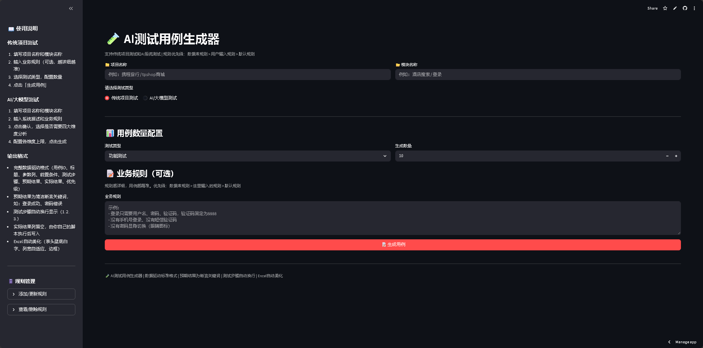
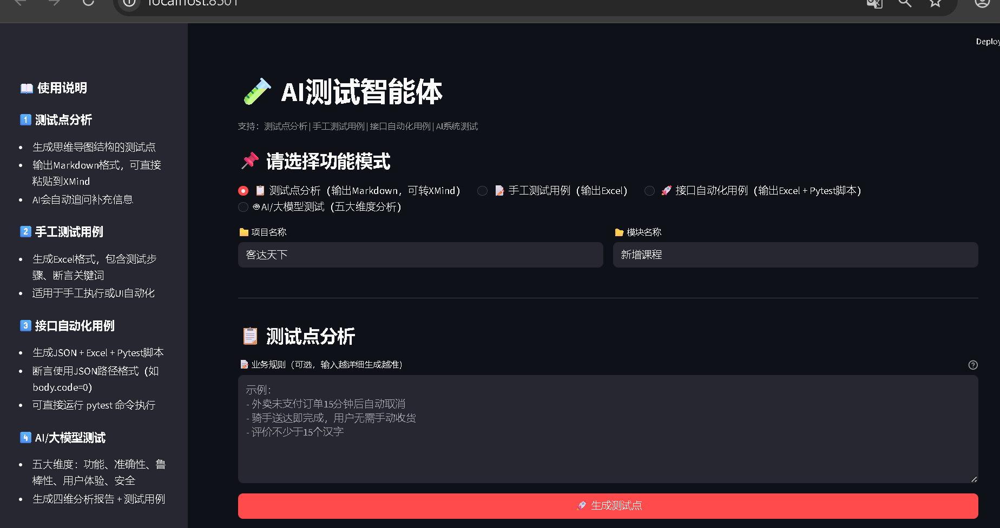
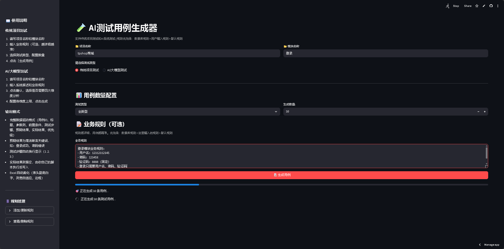
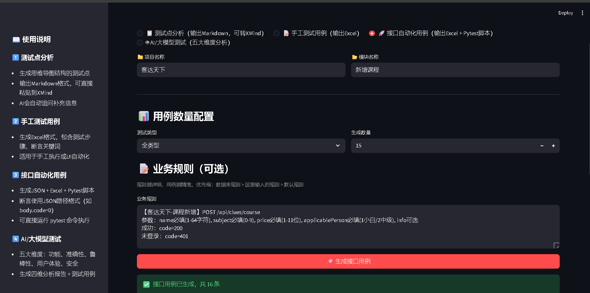
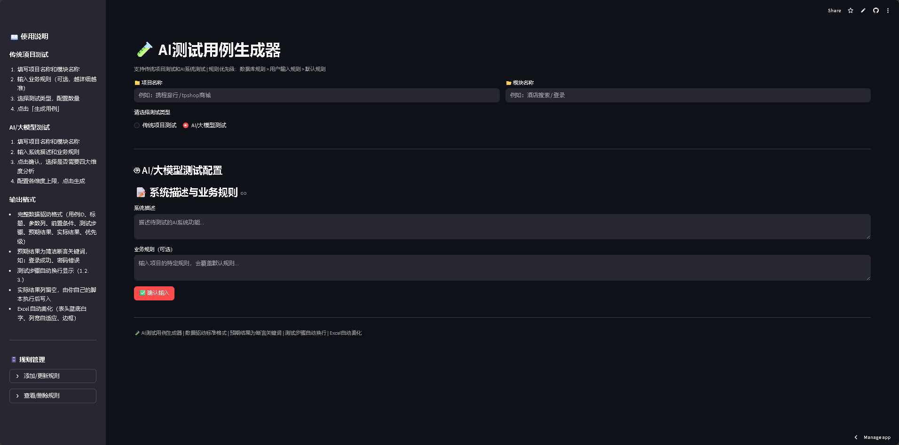
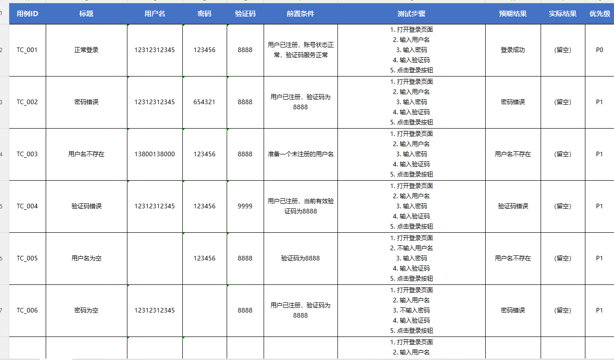

<div align="center">


# 🧪 TestAI - AI驱动的自动化测试用例生成平台

[](https://ailobao.streamlit.app/)

[]()

[]()

[]()

[]()

[]()

[]()

**用AI重新定义软件测试！**

传统测试设计效率提升 **500%+** | **10模块跨项目测试平均98分**

👉 **[点击这里在线体验](https://ailobao.streamlit.app/)**

[问题反馈](https://github.com/ailobao/testcase_agent/issues)

· [功能建议](https://github.com/ailobao/testcase_agent/discussions)

</div>

---

## ✨ 功能特性

### 🎯 核心功能（四模式）

| 功能                 | 描述                                                         |
| -------------------- | ------------------------------------------------------------ |
| **📋 测试点分析**     | 输出Markdown树形测试点，可直接粘贴到XMind生成思维导图，信息不足时AI自动追问 |
| **📝 手工测试用例**   | 生成Excel格式，包含测试步骤、断言关键词，适用于手工执行或UI自动化 |
| **🚀 接口自动化用例** | 生成JSON + Excel + Pytest脚本，断言区分status_code和body.code，正向用例自动提取token |
| **🤖 AI/大模型测试**  | 五大维度（功能/准确性/鲁棒性/用户体验/安全），生成四维分析报告+测试用例 |
| **规则管理**         | 项目/模块级规则配置，数据库持久化，优先级：数据库规则 > 用户规则 > 默认 |
| **自动导出**         | 一键导出Excel，自动美化格式（列宽、表头、边框）              |

### 📊 传统项目测试支持

- **7种测试类型**：功能测试、安全测试、性能测试、兼容性测试、稳定性测试、异常测试、全类型
- **动态参数列**：登录/购物车/下单/搜索等模块自动适配
- **数据驱动格式**：直接对接Pytest等自动化框架
- **自动去重去噪**：智能过滤无效用例

### 🚀 接口自动化用例特色

- **智能识别**：根据请求方法自动将参数放入body(POST)或params(GET)
- **断言规范**：自动区分HTTP状态码(status_code)和业务返回码(body.code)
- **变量提取**：正向用例自动提取token/session_id
- **一键生成**：Excel用例 + Pytest脚本，改个URL就能跑

### 📋 测试点分析特色

- **思维导图友好**：Markdown树形层级，可直接粘贴到XMind
- **智能追问**：信息不足时AI自动追问补充
- **知识库增强**：内置携程、抖音、美团等多项目知识库

### 🤖 AI/大模型专项测试支持

- **四大维度分析**：准确性分析、有用性分析、无害性分析、一致性分析
- **五大维度用例**：功能测试、准确性测试、鲁棒性测试、用户体验测试、安全测试
- **专项安全测试**：提示词注入、越狱攻击、有害内容过滤、偏见歧视、隐私保护

---

## 📊 效果数据

### 最新评估数据（10模块跨项目测试）

| 项目类型     | 平均得分  | 模块数 |
| ------------ | --------- | ------ |
| **电商平台** | 99.4%     | 4      |
| **社交平台** | 100%      | 2      |
| **金融系统** | 98.8%     | 2      |
| **旅游平台** | 92.7%     | 2      |
| **综合平均** | **98.0%** | 10     |

### 评估维度（8维度）

| 维度       | 平均得分 |
| ---------- | -------- |
| 数量达标率 | 10.0/10  |
| 字段完整性 | 10.0/10  |
| 断言规范性 | 9.4/10   |
| 场景覆盖度 | 9.6/10   |
| 提取变量   | 10.0/10  |
| 参数正确性 | 10.0/10  |
| 可执行性   | 9.4/10   |
| URL合理性  | 10.0/10  |

### 效率对比

| 方式           | 耗时             | 覆盖率     | 成本        |
| -------------- | ---------------- | ---------- | ----------- |
| **人工设计**   | 1-2天/模块       | 60-70%     | 高          |
| **TestAI生成** | **3-5分钟/模块** | **85-95%** | **降低80%** |

**效率提升：500%+** 🚀

---

## 🚀 快速开始

### 方式一：在线体验（推荐）

👉 **[点击这里在线体验](https://ailobao.streamlit.app/)** （无需安装，开箱即用）

### 方式二：本地运行

#### 1. 克隆项目

```bash
git clone https://github.com/ailobao/testcase_agent.git
cd testcase_agent
```

#### 2. 配置环境变量

```bash
git clone https://github.com/ailobao/testcase_agent.git
cd testcase_agent
```

💡 **获取API Key**：

- 登录[阿里百炼平台](https://bailian.console.aliyun.com/)

- 创建API Key

- 选择 deepseek-v4-pro 模型

- #### 3. 安装依赖

  ```
  pip install -r requirements.txt
  ```

  #### 4. 运行项目

  ```
  streamlit run app.py
  ```

  然后打开浏览器访问：**[http://localhost:8501]**

  ## 🛠️ 技术栈

  | 层级         | 技术选型                         |
  | :----------- | :------------------------------- |
  | **前端界面** | Streamlit                        |
  | **大模型**   | DeepSeek V4 Pro / V3（阿里百炼） |
  | **LLM框架**  | LangChain                        |
  | **数据库**   | SQLite                           |
  | **数据处理** | Pandas, OpenPyXL                 |
  | **重试机制** | Tenacity                         |
  | **部署**     | Streamlit Community Cloud        |

## 📸 产品截图

<details>
<summary>点击展开查看截图</summary>

### 🏠 主界面（四模式）



<br>

### 📋 测试点分析模式



<br>

### 📝 手工测试用例



<br>

### 🚀 接口自动化用例



<br>

### 🤖 AI系统专项测试



<br>

### 📊 Excel导出效果



</details>

## 📖 使用说明

### 测试点分析模式

1. 填写项目名称和模块名称
2. 输入业务规则（可选）
3. 点击「生成测试点」
4. 信息不足时AI会追问补充
5. 下载MD文件，直接粘贴到XMind生成思维导图

### 手工测试用例模式

1. 填写项目名称和模块名称
2. 输入业务规则（越详细越准确）
3. 选择测试类型，配置生成数量
4. 点击「生成用例」
5. 查看生成结果，下载Excel

### 接口自动化用例模式

1. 填写项目名称和模块名称
2. 输入业务规则（包含接口URL、参数规则）
3. 选择测试类型，配置期望数量
4. 点击「生成接口用例」
5. 下载Excel用例和Pytest脚本
6. 修改BASE_URL，运行 `pytest xxx.py -v`

### AI/大模型专项测试

1. 填写项目名称和模块名称
2. 输入系统描述和业务规则
3. 选择是否需要四大维度分析
4. 配置各维度用例上限
5. 点击生成
6. 查看分析报告和测试用例

### 规则管理

- 在侧边栏「规则管理」中，可以添加/更新/删除项目规则
- 规则优先级：数据库规则 > 用户输入规则 > 默认规则
- 支持配置输入字段、验证码、额外功能、约束条件等

## 🎯 核心优势

### 1. 四模式全覆盖

- 测试点分析 → XMind思维导图
- 手工用例 → Excel执行
- 接口用例 → Pytest脚本
- AI测试 → 五维度分析报告

### 2. 高质量输出

- 专业提示词工程，严格的格式约束
- 断言区分status_code和body.code
- 正向用例自动提取token

### 3. 智能评估闭环

- 生成 → 评估 → 优化的完整闭环
- 代码统计 + DeepSeek双评估体系

### 4. 开箱即用

- 无需复杂配置，3分钟上手
- 提供公网演示，直接体验

## 🗺️ 路线图

- ✅ v1.0 - 基础版本发布（传统测试+AI测试双模式）
- ✅ v1.1 - 规则管理系统
- ✅ v1.2 - 8维度自动评估系统
- ✅ v1.3 - 接口自动化用例模式
- ✅ v1.4 - 测试点分析模式
- 🔄 v1.5 - 模板市场（计划中）
- 🔄 v1.6 - 用例在线编辑（计划中）
- 🔄 v2.0 - 自动化代码生成（规划中）

## 🤝 贡献指南

欢迎提交 Issue 和 Pull Request！

1. Fork 本仓库
2. 创建你的 Feature 分支 (`git checkout -b feature/AmazingFeature`)
3. 提交你的改动 (`git commit -m 'Add some AmazingFeature'`)
4. 推送到分支 (`git push origin feature/AmazingFeature`)
5. 打开一个 Pull Request

## 📝 许可证

本项目采用 MIT 许可证 - 查看 [LICENSE](https://./LICENSE)文件了解详情

## 🙏 致谢

- 感谢 [阿里百炼](https://bailian.console.aliyun.com/) 提供的大模型服务
- 感谢 [DeepSeek](https://www.deepseek.com/) 提供的优秀模型
- 感谢 [LangChain](https://www.langchain.com/) 提供的框架支持
- 感谢 [Streamlit](https://streamlit.io/) 提供的快速部署方案

<div align="center">

**如果这个项目对你有帮助，欢迎 Star ⭐ 支持一下！

**有问题或建议？欢迎提交 [Issue](https://github.com/ailobao/testcase_agent/issues)

</div> ```
